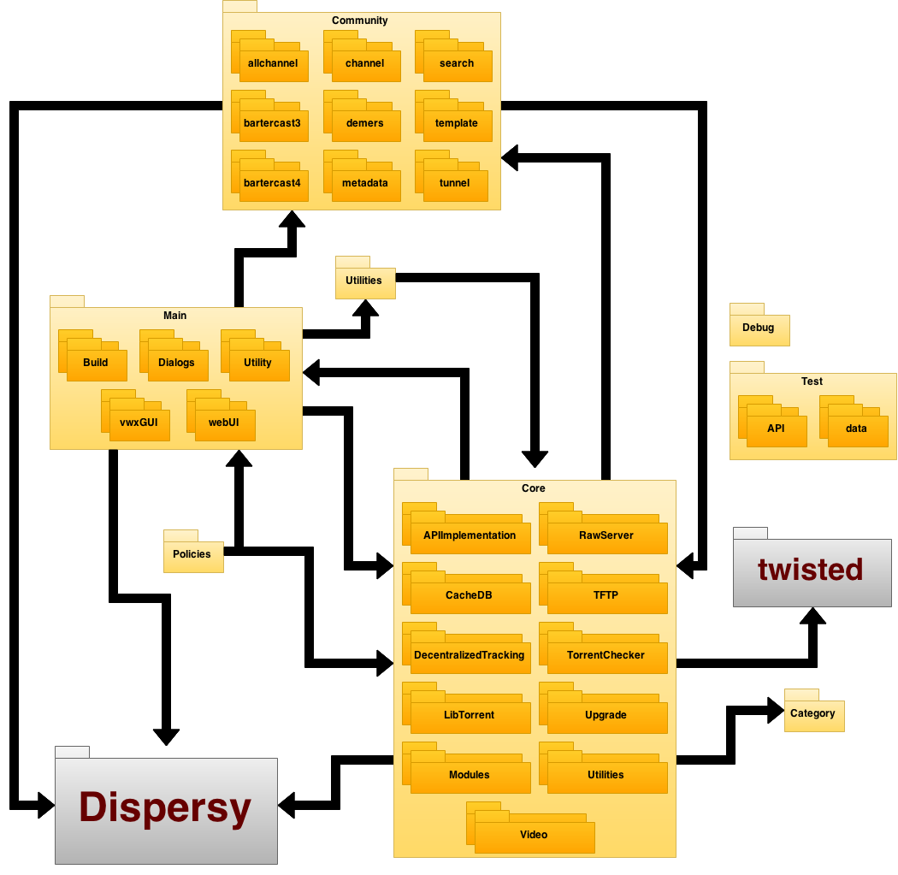

# Architectural Structure

| Folder                                            | Subfolder                                                     | Description   |
|---------------------------------------------------|---------------------------------------------------------------|---------------|
| [Category](/Tribler/Category)                     | -                                                             | Contains code to categorize torrents and filter the categories according to filter preferences.               |
| [Core](/Tribler/Core)                             | -                                                             | Contains the core functionalities of the tribler project.                                                     |
|                                                   | [APIImplementation](/Tribler/Core/APIImplementation)          | Contains the API for torrents, creating them and maintaining them.             |
|                                                   | [CacheDB](/Tribler/Core/CacheDB)                              | Contains the cached database for Tribler, including a notifier, and manages different versions.              |
|                                                   | [DecentralizedTracking](/Tribler/Core/DecentralizedTracking)  | Contains the pymdht library for profiling network information.              |
|                                                   | [Libtorrent](/Tribler/Core/Libtorrent)                        | Contains code to manage the torrent library.              |
|                                                   | [Modules](/Tribler/Core/Modules)                              | Contains the tracker manager.              |
|                                                   | [RawServer](/Tribler/Core/RawServer)                          | Contains the Raw Server including a Socket Handler and a polling system.              |
|                                                   | [TFTP](/Tribler/Core/TFTP)                                    | Contains the the TFTP handler that should be registered at the Raw Server to handle TFTP packets.              |
|                                                   | [TorrentChecker](/Tribler/Core/TorrentChecker)                | Contains code that checks and schedules torrents.              |
|                                                   | [Upgrade](/Tribler/Core/Upgrade)                              | Contains information on how to update Tribler and its database to the new version.              |
|                                                   | [Utilities](/Tribler/Core/Utilities)                          | Contains different utility files that are used in the project.              |
|                                                   | [Video](/Tribler/Core/Video)                                  | Contains the VLCWrapper and code to stream live data in Tribler.              |
| [Community](/Tribler/community)                   | -                                                             | Contains code to create and securely communicate with different communities.              |
|                                                   | [allchannel](/Tribler/community/allchannel)                   | Contains contains code for a single community that all Tribler members join and use to disseminate .torrent files.              |
|                                                   | [bartercast3](/Tribler/community/bartercast3)                 | Contains the protocol for indirect reciprocity. Provides the incentive to seeding and proxy relay in Tribler.              |
|                                                   | [bartercast4](/Tribler/community/bartercast4)                 | ???              |
|                                                   | [channel](/Tribler/community/channel)                         | ???              |
|                                                   | [demers](/Tribler/community/demers)                           | ???              |
|                                                   | [metadata](/Tribler/community/metadata)                       | ???              |
|                                                   | [search](/Tribler/community/search)                           | ???              |
|                                                   | [template](/Tribler/community/template)                       | Contains Example files for communities              |
|                                                   | [tunnel](/Tribler/community/tunnel)                           | Defines a ProxyCommunity which discovers other proxies and offers an API to create and reserve circuits.              |
| [Debug](/Tribler/Debug)                           | -                                                             | Contains code to debug Tribler.              |
| [Dispersy](https://github.com/Tribler/dispersy)   | -                                                             | Elastic Database System that is the backbone to Tribler's functionality.       |
| [Main](/Tribler/Main)                             | -                                                             | Contains code for the UI of Tribler.              |
|                                                   | [Build](/Tribler/Main/Build)                                  | Contains build files for different Operating Systems.              |
|                                                   | [Dialogs](/Tribler/Main/Dialogs)                              | Contains the different dialogs that are shown within Tribler.              |
|                                                   | [Utility](/Tribler/Main/Utility)                              | Contains different utility classes used in the Main package.              |
|                                                   | [vwxGUI](/Tribler/Main/vwxGUI)                                | Contains code for the regular (non-browser) GUI of Tribler.               |
|                                                   | [webUI](/Tribler/Main/webUI)                                  | Contains code to create a user interface that can be viewed using a browser.              |
| [Policies](/Tribler/Policies)                     | -                                                             | Contains different code for rate and seeding policies in Tribler.              |
| [Test](/Tribler/Test)                             | -                                                             | Contains unit tests for Tribler.              |
|                                                   | [API](/Tribler/Test/API)                                      | Contains tests for the API.              |
|                                                   | [data](/Tribler/Test/data)                                    | Contains data needed for tests.              |
| [Utilities](/Tribler/Utilities)                   | -                                                             | Contains different utility classes used in Tribler               |
| [twisted](https://github.com/twisted)             | -                                                             | Event Driven Networking Engine        |

######Maintenance
Inside the [Resources](Resources) folder, there is a .xml file that can be opened in [Draw.io](https://www.draw.io), where it can be adapted/altered as needed.
