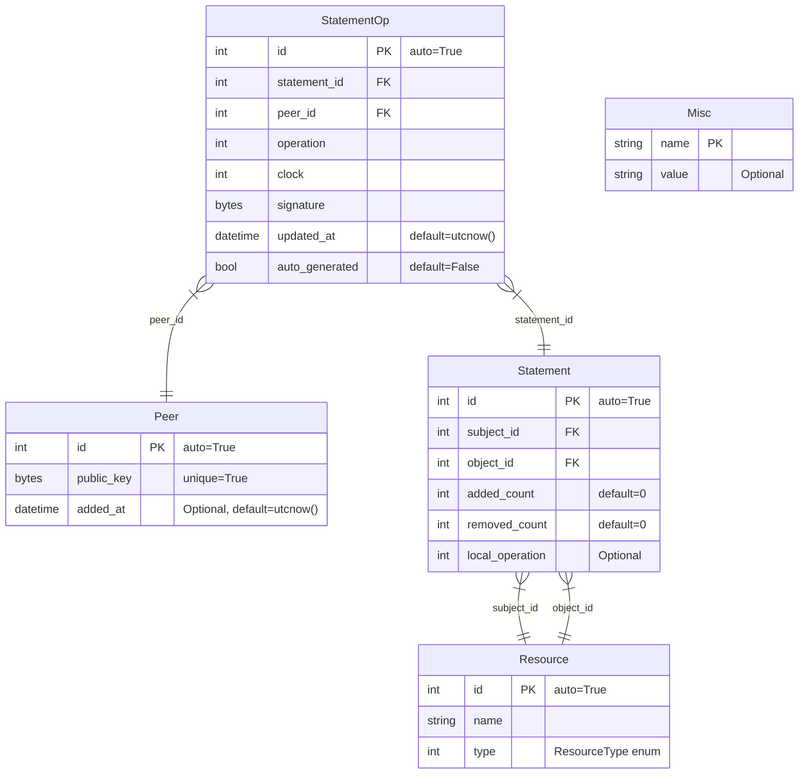

Below you can find a brief description of the Knowledge Component. For more
information please check the source code the following issues:

- https://github.com/Tribler/tribler/issues/6214
- https://github.com/Tribler/tribler/issues/7837

## Database

The full schema is available at
https://github.com/Tribler/tribler/blob/main/src/tribler/core/components/database/db/layers/knowledge_data_access_layer.py

It describes `Statements` that are linked to a `Peer` (through a digital signature) who created that statement. To
anonymize the peer, not their main public key is used, but a secondary key as described

```python
        # secondary key:
secondary_private_key_path = config.state_dir / config.trustchain.secondary_key_filename
self.secondary_key = self.load_or_create(secondary_private_key_path)
```

https://github.com/Tribler/tribler/blame/26b0be8c4010a6546f9204bb2f0026597dea53a7/src/tribler/core/components/key/key_component.py#L24-L26

In the `KnowledgeGraph`, a `Statement` is an edge with the following (simplified) structure:

```python
@dataclass
class SimpleStatement:
    subject_type: ResourceType
    subject: str
    predicate: ResourceType
    object: str
```

https://github.com/Tribler/tribler/blob/76de5620ed7f1e991e9d1adc4cb905ae8a5db8b3/src/tribler/core/components/database/db/layers/knowledge_data_access_layer.py#L60-L65

Where `ResourceType` is

```python
class ResourceType(IntEnum):
    """ Description of available resources within the Knowledge Graph.
    These types are also using as a predicate for the statements.

    Based on https://en.wikipedia.org/wiki/Dublin_Core
    """
    CONTRIBUTOR = 1
    COVERAGE = 2
    CREATOR = 3
    DATE = 4
    DESCRIPTION = 5
    FORMAT = 6
    IDENTIFIER = 7
    LANGUAGE = 8
    PUBLISHER = 9
    RELATION = 10
    RIGHTS = 11
    SOURCE = 12
    SUBJECT = 13
    TITLE = 14
    TYPE = 15

    # this is a section for extra types
    TAG = 101
    TORRENT = 102
    CONTENT_ITEM = 103
```

https://github.com/Tribler/tribler/blob/26b0be8c4010a6546f9204bb2f0026597dea53a7/src/tribler/core/components/database/db/layers/knowledge_data_access_layer.py#L32-L57

Statement examples:

```python
SimpleStatement(subject_type=ResourceType.TORRENT, subject='infohash1', predicate=ResourceType.TAG, object='tag1')
SimpleStatement(subject_type=ResourceType.TORRENT, subject='infohash2', predicate=ResourceType.TAG, object='tag2')
SimpleStatement(subject_type=ResourceType.TORRENT, subject='infohash3', predicate=ResourceType.CONTENT_ITEM,
                object='content item')
```

Due to the inherent lack of trust in peers, we cannot simply replace an existing statement with a newly received one.
Instead, we store all `statement-peer` pairs. This approach allows for the potential to downvote or upvote all
statements associated with a particular peer, depending on whether that peer becomes trusted or not. Currently, we lack
a reliable trust function, and this design was implemented with the anticipation that such a function would be developed
in the future. This assumption has proven to be correct, as the design is compatible with the `MeritRank`. Furthermore,
it appears that all necessary data is already present within the `KnowledgeGraph`, making it well-suited for future
integration with trust evaluation mechanisms.

There are two operations available for peers:

```python
class Operation(IntEnum):
    """ Available types of statement operations."""
    ADD = 1  # +1 operation
    REMOVE = 2  # -1 operation
```

https://github.com/Tribler/tribler/blob/26b0be8c4010a6546f9204bb2f0026597dea53a7/src/tribler/core/components/database/db/layers/knowledge_data_access_layer.py#L26-L29

All operations are recorded in the database, allowing for the calculation of the final score of a specific operation
based on the cumulative actions taken by all peers. This approach enables a comprehensive assessment of each operation's
overall impact within the network.

We use clocks (lamport-like) for operations based on triplets {public_key, operation, infohash}

Currently, a simplistic approach is employed, which involves merely summing all the 'add' operations (+1) and
subtracting the 'remove' operations (-1) across all peers. This method is intended to be replaced by a more
sophisticated mechanism, the `MeritRank` merit function.

https://github.com/Tribler/tribler/blob/26b0be8c4010a6546f9204bb2f0026597dea53a7/src/tribler/core/components/database/db/layers/knowledge_data_access_layer.py#L98-L100

### ER diagram



## Community

https://github.com/Tribler/tribler/blob/main/src/tribler/core/components/knowledge/community/knowledge_community.py

The algorithm of the community's operation:

1. Every 5 seconds, we request 10 `StatementOperations` from a random peer.
   https://github.com/Tribler/tribler/blob/44e2235e0b3bcdc12ae2fcd874bc058474973e5b/src/tribler/core/components/knowledge/community/knowledge_payload.py#L8-L18

```python
@dataclass
class StatementOperation:
    """Do not change the format of the StatementOperation, because this will result in an invalid signature.
    """
    subject_type: int  # ResourceType enum
    subject: str
    predicate: int  # ResourceType enum
    object: str
    operation: int  # Operation enum
    clock: int  # This is the lamport-like clock that unique for each quadruple {public_key, subject, predicate, object}
    creator_public_key: type_from_format('74s')
```

2. Upon receiving a response, we verify the signatures of the operations and their validity.

```python
    def verify_signature(self, packed_message: bytes, key: Key, signature: bytes, operation: StatementOperation):


if not self.crypto.is_valid_signature(key, packed_message, signature):
    raise InvalidSignature(f'Invalid signature for {operation}')
```   

https://github.com/Tribler/tribler/blob/44e2235e0b3bcdc12ae2fcd874bc058474973e5b/src/tribler/core/components/knowledge/community/knowledge_community.py#L126-L128

```python
    def validate_operation(operation: StatementOperation):


validate_resource(operation.subject)
validate_resource(operation.object)
validate_operation(operation.operation)
validate_resource_type(operation.subject_type)
validate_resource_type(operation.predicate)
```

https://github.com/Tribler/tribler/blob/44e2235e0b3bcdc12ae2fcd874bc058474973e5b/src/tribler/core/components/knowledge/community/knowledge_community.py#L119-L124

3. When `StatementOperations` are requested from us, we select N random operations (the number of operations is
   specified in the request) and return them.

Design decisions behind the Community:

- Knowledge operations gossiped transitively across the network
- Pull-based gossip is used
- For knowledge' integrity check ipv8 signatures are used

## UI

Two changes have been made to the UI:

1. Elements for displaying tags (this feature is hided at the current moment).
   

2. A dialog for editing metadata:
   

## Content Bundling

"Content Bundle" is a strategic feature in Tribler aimed at enhancing the organization
and accessibility of digital content. It acts as an aggregation point for torrents,
bundling them together under a single, cohesive unit. This structure allows users to
efficiently manage and access groups of related torrents, simplifying navigation
and retrieval. Ideal for categorizing content that shares common themes, attributes,
or sources, the Content Bundle provides a streamlined way to handle complex sets of
information, making it easier for users to find and interact with a rich array of
content within the Tribler network.
https://github.com/Tribler/tribler/blob/main/src/tribler/core/components/knowledge/rules/content_bundling.py


The general approach for grouping items is to calculate N-Grams with TFIDF for numbers in items and cluster them using
HDBSCAN. For full information, see https://github.com/Tribler/tribler/issues/7837.

The actual implementation differs slightly from the general approach but is essentially a simplification and
optimization of it.

Content Bundling is conditional. The condition is based on
the [Corrected Type-Token Ratio (CTTR)](https://core.ac.uk/download/pdf/82620241.pdf) formula.